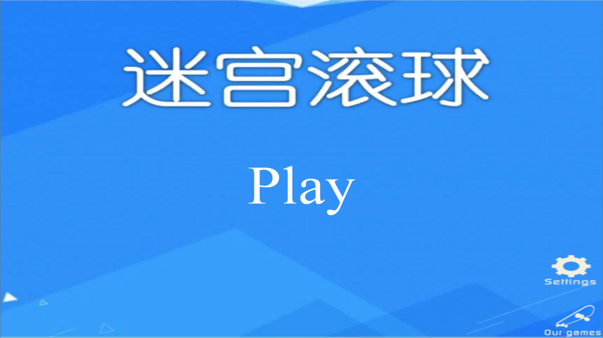
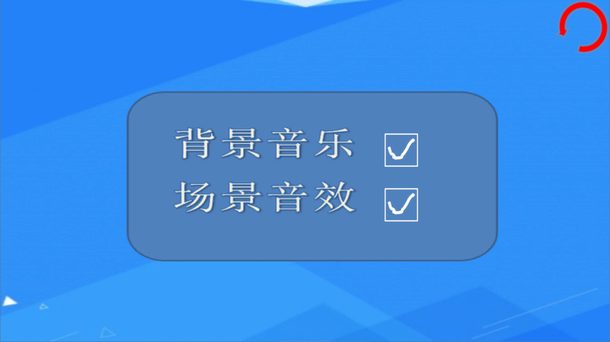
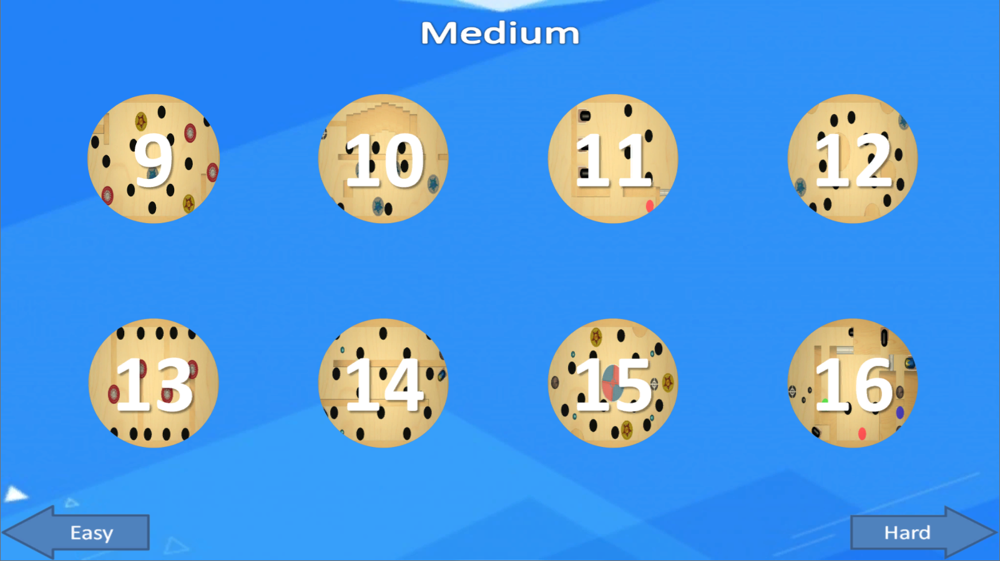
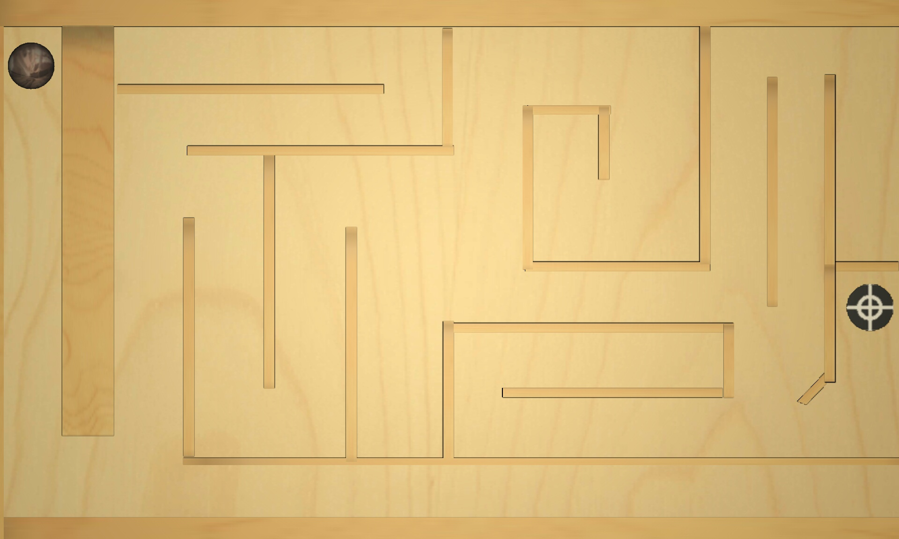
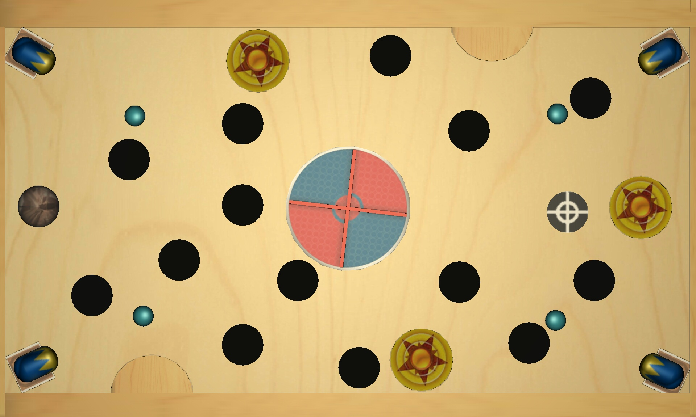
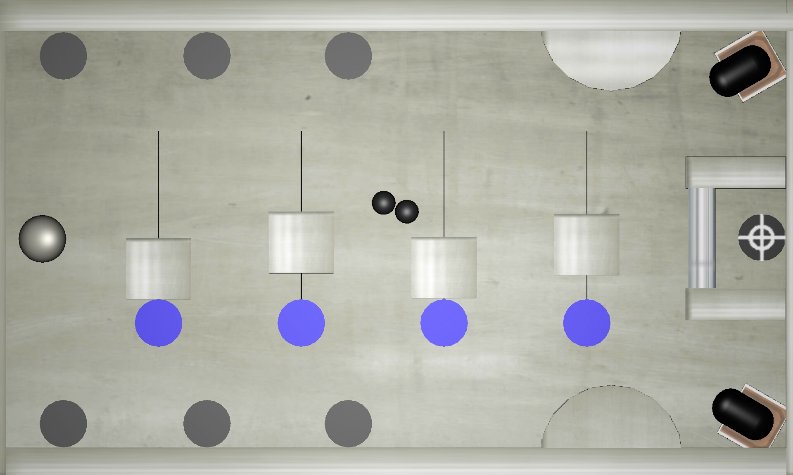
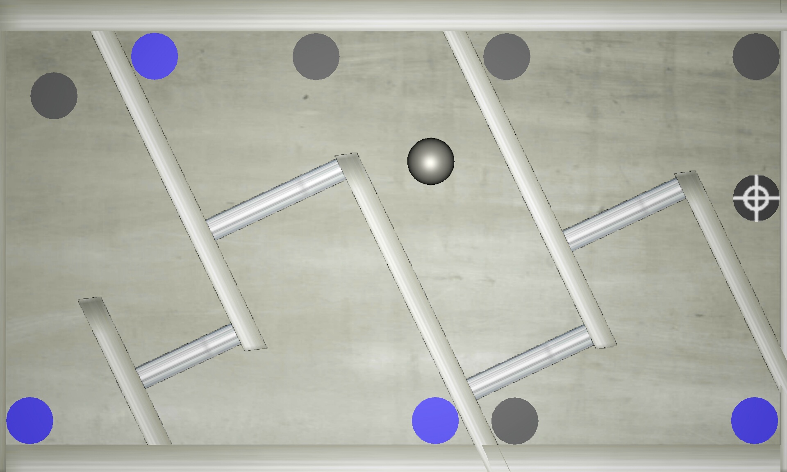
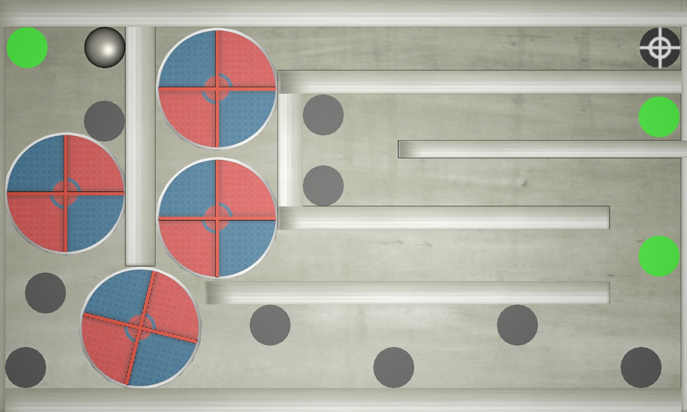
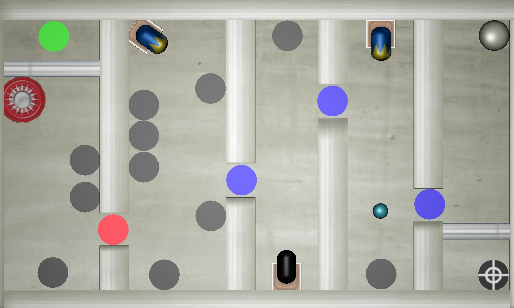

# Labyrinth

一款使用Unity 3D开发的3D迷宫滚球游戏。

游戏创意及贴图素材参考游戏 [Labyrinth 2 Lite](http://www.appchina.com/app/se.illusionlabs.labyrinth2.lite/) ，如若侵权，请及时与我联系。

**可运行程序下载**

- [Windows版本](https://github.com/sywei11/Labyrinth/releases/download/1.0/Labyrinth.zip)（电脑下载解压即可运行，上下左右控制小球移动）
- [Android版本](https://github.com/sywei11/Labyrinth/releases/download/1.0/Labyrinth2.5.apk)（手机下载安装即可运行，重力感应控制小球移动）

## 介绍

3D迷宫滚球游戏是一款休闲益智类游戏，由玩家控制小球通过迷宫，从起点走向终点。

- 设计了简单、中等、困难三种不同难度的24个关卡。
- 为丰富游戏的娱乐性和挑战性，设置了多种游戏组件，如移动的墙体、弹性柱、旋转圆盘、加农炮、弹力炮和功能不同的触发器等。
- 实现了游戏各界面的流畅运行，添加了背景音乐，并为不同组件设置了音效，同时设置了背景音乐与音效开关。

### 界面预览

 

 

 

 

 

### 创意点

针对不同关卡，设计了不同功能的触发器，增加了难度和娱乐性。例如：

- 第18关，设置触发索引值，当小球将全部触发器都触发时，门才会打开

   

- 第20关，触发器控制门的移动，设置延时一段时间后，门自动回到初始位置，阻挡小球移动

   

- 第21关，触发器控制圆盘旋转

   

- 第24关，小球多次通过触发器，来循环改变弹力球的速度，加农炮弹发射时间间隔，炮塔发射角度

   